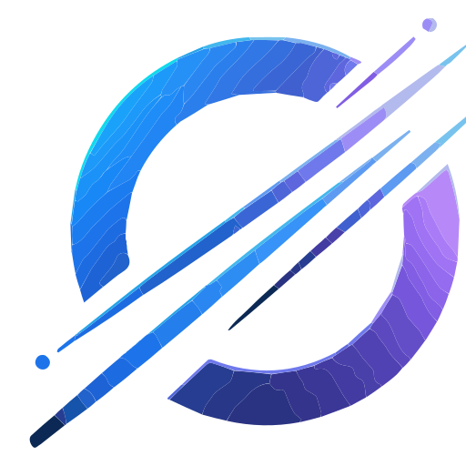

  

  <h1>Hi, I'm Mil1n 👋</h1>

  

    <strong>Beginner developer learning Full-Stack Development</strong> 
    Backend • Web Apps • Game Development
  

  
  

---

## 👨‍💻 About Me

- 🚀 I’m building my path toward **Full-Stack Development**.
- 🌱 Currently learning **Python**, **JavaScript**, **React**, and **Node.js**.
- 🛠️ I practice by building small apps, APIs, automation tools, and game prototypes.
- 🤝 Open to beginner-friendly collaborations and learning-focused open source.
- 🇷🇺 Также открыт к общению и совместным проектам на русском языке.

---

## 🎯 Current Focus

| Step | Focus | Goal |
| --- | --- | --- |
| 1 | Backend API | Build clean CRUD endpoints |
| 2 | Frontend UI | Connect React pages to an API |
| 3 | Database | Store and manage real app data |
| 4 | Project polish | Improve structure, UI, and README docs |
| 5 | Deployment | Publish a finished full-stack project |

---

## 🧰 Tech Stack

<table>
  <tr>
    <td><strong>Comfortable with</strong></td>
    <td>
      
      
    </td>
  </tr>
  <tr>
    <td><strong>Learning</strong></td>
    <td>
      
      
      
    </td>
  </tr>
  <tr>
    <td><strong>Interested in</strong></td>
    <td>REST APIs • Databases • Authentication • 2D games • Deployment</td>
  </tr>
</table>

---

## 🗺️ Learning Roadmap

| Backend | Frontend | Full-stack |
| --- | --- | --- |
| ✅ Python basics | ⬜ JavaScript fundamentals | ⬜ Connect frontend to API |
| ✅ Git basics | ⬜ React components and hooks | ⬜ Store data in a database |
| ⬜ REST API basics | ⬜ Forms and API requests | ⬜ Deploy a web app |
| ⬜ Database basics | ⬜ Responsive layouts | ⬜ Add project screenshots |
| ⬜ Auth basics | ⬜ UI polish | ⬜ Write tests for APIs |

---

## 🚀 Projects I Want to Build

| Project | Practice goal | Possible stack | Status |
| --- | --- | --- | --- |
| Task Manager | CRUD, REST API, forms | React + Node.js | Planned |
| Notes App | API routes, database models, simple UI | Python/Node.js + SQLite | Planned |
| 2D Game | Game loop, movement, collisions | Python + Pygame or JS Canvas | Planned |
| Portfolio Website | Responsive layout and deployment | React | Planned |
| Automation Tools | Scripts for useful daily workflows | Python | Planned |

---

## 📌 Next Milestones

- [ ] Publish the first finished beginner project
- [ ] Add screenshots and setup instructions to project READMEs
- [ ] Practice clean commits and pull requests
- [ ] Learn basic testing for backend APIs
- [ ] Deploy one full-stack application

---

## 📊 GitHub Stats

  
  

---

## 🤝 Let’s Collaborate

I’m open to small beginner-friendly projects, backend APIs, web apps, game experiments, and learning-focused open-source contributions.

  

---

  <strong>☕ I turn coffee into code and bugs into lessons.</strong>

