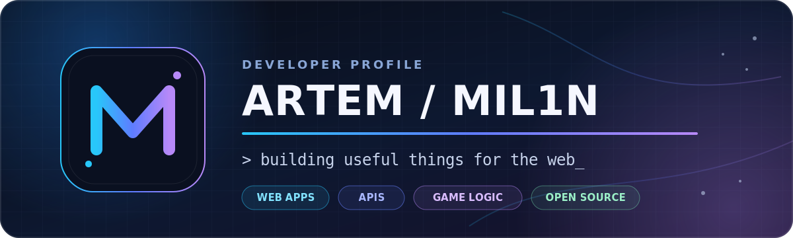

<p align="center">
  
</p>

<p align="center">
  <strong>Full-stack developer building practical web products, browser games, and Windows tools.</strong><br />
  <sub>TypeScript · JavaScript · Python · C#</sub>
</p>

<p align="center">
  <a href="https://github.com/Mil1n?tab=repositories">Projects</a>
  ·
  <a href="https://t.me/themil1n">Telegram</a>
</p>

## About

I learn by shipping complete vertical slices: interface, application logic, data, tests, and documentation. My public work currently spans React/TypeScript frontends, Node.js and Python backends, browser game engines, and C#/.NET desktop software.

- Building useful MVPs and turning the strongest ones into polished, maintainable projects.
- Improving architecture, automated testing, accessibility, and deployment workflows.
- Open to focused collaborations, code feedback, and learning-oriented open source.

## Selected work

<table>
  <tr>
    <td width="50%" valign="top">
      <h3><a href="https://github.com/Mil1n/Mini-Blog-Notes">Mini Blog / Notes</a></h3>
      <p>A full-stack notes app with Markdown, drafts, tags, optimistic actions, JWT authentication, and owner-scoped CRUD.</p>
      <p><code>React</code> <code>TypeScript</code> <code>Express</code> <code>Prisma</code></p>
    </td>
    <td width="50%" valign="top">
      <h3><a href="https://github.com/Mil1n/URL-Shortener">URL Shortener</a></h3>
      <p>A dependency-light Python service with analytics, scoped API keys, A/B routing, webhooks, rate limits, and tests.</p>
      <p><code>Python</code> <code>WSGI</code> <code>SQLite</code> <code>REST API</code></p>
    </td>
  </tr>
  <tr>
    <td width="50%" valign="top">
      <h3><a href="https://github.com/Mil1n/Checkers">Checkers Grandmaster</a></h3>
      <p>A Russian checkers engine with forced captures, alpha-beta search, explainable analysis, Web Worker execution, and tests.</p>
      <p><code>JavaScript</code> <code>Game engine</code> <code>Web Worker</code></p>
    </td>
    <td width="50%" valign="top">
      <h3><a href="https://github.com/Mil1n/SAM">Steam Achievement Manager</a></h3>
      <p>An independently maintained Windows adaptation based on Rick Gibbed's original open-source project, with detailed documentation and automated releases.</p>
      <p><code>C#</code> <code>.NET</code> <code>Windows</code> <code>GitHub Actions</code></p>
    </td>
  </tr>
</table>

More experiments: [WeatherPulse](https://github.com/Mil1n/Weather-Pulse) · [Chess Prime](https://github.com/Mil1n/Chess) · [Smart Calculator](https://github.com/Mil1n/Calculator) · [Private Social Network](https://github.com/Mil1n/Social-Network)

## Toolbox

| Area | Tools |
| --- | --- |
| Languages | TypeScript, JavaScript, Python, C# |
| Frontend | React, Zustand, Tailwind CSS, Vanilla JS, PWA |
| Backend & data | Node.js, Express, Prisma, SQLite, Python WSGI |
| Quality & delivery | Vitest, node:test, Git, GitHub Actions |

```text
idea -> working slice -> tests -> polish -> docs -> ship
```

## Current focus

1. Take the best prototypes beyond the MVP stage with stronger architecture and CI.
2. Add screenshots, live demos, and reproducible setup to the projects worth showcasing.
3. Go deeper into production backends, authentication, databases, and deployment.

## Contact

Have a compact product idea, an interesting game mechanic, or useful feedback? [Message me on Telegram](https://t.me/themil1n).

Также открыт к общению и совместным проектам на русском языке.

<p align="center"><sub>Build small. Learn fast. Document the result.</sub></p>
